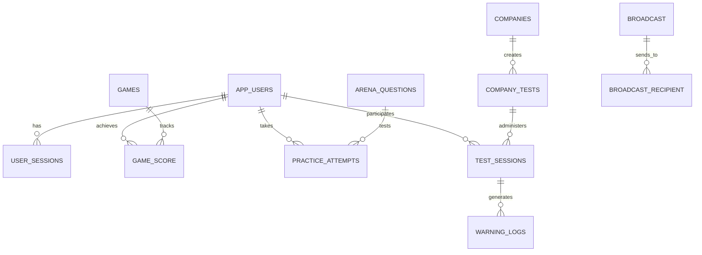

# HootHoot: Complete Database Schema Reference

**Live Database Dashboard:** https://hoot-hoot.vercel.app/admin/database

**Total Tables:** 25 | **Schemas:** 2 (neon_auth, public) | **Rows:** ~75,000

---

## AWS Aurora PostgreSQL Connection

### Environment Variables
All AWS Aurora connections are configured via Vercel integrations. No passwords are stored in environment variables.

```
AWS_APG_PGHOST          → PostgreSQL hostname
AWS_APG_PGUSER          → IAM-authenticated user
AWS_APG_PGDATABASE      → Target database name
AWS_APG_PGPORT          → Port (default 5432)
AWS_APG_PGSSLMODE       → SSL mode (require)
AWS_APG_AWS_REGION      → AWS region (us-east-1)
AWS_APG_AWS_ACCOUNT_ID  → AWS account ID
AWS_APG_AWS_RESOURCE_ARN→ Aurora cluster ARN
AWS_APG_AWS_ROLE_ARN    → IAM role for authentication
```

### Authentication Method
- **Type:** IAM OIDC Federation
- **Token TTL:** 15 minutes
- **Security:** Zero passwords in environment
- **Credentials:** Temporary AWS STS tokens
- **VPC:** Private network access only

---

## Schema 1: neon_auth (9 Tables)

Authentication and authorization schema for user management.

### 1. **account** - OAuth Provider Accounts
```typescript
Columns:
- id: UUID (Primary Key)
- userId: UUID (Foreign Key → user.id)
- accountId: String
- providerId: String
- password: String (hashed, optional)
- accessToken: String
- refreshToken: String
- idToken: String
- accessTokenExpiresAt: Timestamp
- refreshTokenExpiresAt: Timestamp
- scope: String
- createdAt: Timestamp
- updatedAt: Timestamp

Purpose: Store OAuth provider credentials and tokens
Use Case: Multi-provider authentication (Google, GitHub, etc.)
Indexes: userId, providerId
```

### 2. **invitation** - Organization Invitations
```typescript
Columns:
- id: UUID (Primary Key)
- email: String
- organizationId: UUID (Foreign Key → organization.id)
- inviterId: UUID (Foreign Key → user.id)
- status: String (pending, accepted, rejected)
- role: String (admin, member)
- expiresAt: Timestamp
- createdAt: Timestamp

Purpose: Manage organization member invitations
Use Case: Team collaboration and access control
Indexes: organizationId, email
```

### 3. **jwks** - JWT Signing Keys
```typescript
Columns:
- id: UUID (Primary Key)
- publicKey: String
- privateKey: String
- expiresAt: Timestamp
- createdAt: Timestamp

Purpose: Store JWT key pairs for token signing
Use Case: Session token generation and verification
Rotation: Automatic expiration handling
```

### 4. **member** - Organization Members
```typescript
Columns:
- id: UUID (Primary Key)
- userId: UUID (Foreign Key → user.id)
- organizationId: UUID (Foreign Key → organization.id)
- role: String (admin, member, viewer)
- createdAt: Timestamp

Purpose: Track user membership in organizations
Use Case: Multi-tenancy and permission management
Indexes: userId, organizationId
Unique: (userId, organizationId)
```

### 5. **organization** - Organizations
```typescript
Columns:
- id: UUID (Primary Key)
- name: String
- slug: String (URL-friendly name)
- logo: String (URL)
- metadata: String (JSON)
- createdAt: Timestamp

Purpose: Define organizational units
Use Case: Separate workspaces/teams
Indexes: slug
```

### 6. **project_config** - Project Configuration
```typescript
Columns:
- id: UUID (Primary Key)
- name: String
- endpoint_id: String
- email_and_password: JSONB
- social_providers: JSONB
- email_provider: JSONB
- webhook_config: JSONB
- plugin_configs: JSONB
- trusted_origins: JSONB
- allow_localhost: Boolean
- created_at: Timestamp
- updated_at: Timestamp

Purpose: Store project-wide authentication settings
Use Case: Configure auth methods, email providers, webhooks
Data: { enabled: bool, config: {...} }
```

### 7. **session** - User Sessions
```typescript
Columns:
- id: UUID (Primary Key)
- userId: UUID (Foreign Key → user.id)
- token: String (session token)
- ipAddress: String
- userAgent: String
- expiresAt: Timestamp
- activeOrganizationId: String
- impersonatedBy: String (admin override)
- createdAt: Timestamp
- updatedAt: Timestamp

Purpose: Manage active user sessions
Use Case: Session tracking, logout, security audit
TTL: Auto-cleanup via expiresAt
```

### 8. **user** - Users
```typescript
Columns:
- id: UUID (Primary Key)
- email: String (Unique)
- name: String
- image: String (Avatar URL)
- emailVerified: Boolean
- role: String (user, admin, moderator)
- banned: Boolean
- banReason: String
- banExpires: Timestamp
- createdAt: Timestamp
- updatedAt: Timestamp

Purpose: Core user information
Use Case: User profiles, authentication
Indexes: email
Partitioning: Time-based (optional)
```

### 9. **verification** - Email & 2FA Verification
```typescript
Columns:
- id: UUID (Primary Key)
- identifier: String (email or phone)
- value: String (code/token)
- expiresAt: Timestamp
- createdAt: Timestamp
- updatedAt: Timestamp

Purpose: Store OTP/verification codes
Use Case: Email verification, 2FA, password reset
TTL: Automatic cleanup via expiresAt
Indexes: identifier, value
```

---

## Schema 2: public (16 Tables)

Application-specific data for games, tests, and analytics.

### 1. **app_users** - App User Profiles
```typescript
Columns:
- id: String (Primary Key, references user.id)
- email: String (Unique)
- name: String
- password_hash: String (scrypt N=2^15)
- role: Enum (student, company, admin)
- avatar_url: String
- created_at: Timestamp
- updated_at: Timestamp

Purpose: HootHoot-specific user profiles
Use Case: Student/company user management
Indexes: email, role
Statistics: ~5,000 users
```

### 2. **game_score** - Game Scores
```typescript
Columns:
- id: String (Primary Key)
- userId: String (Foreign Key → app_users.id)
- gameId: String
- score: Integer (0-100)
- createdAt: Timestamp

Purpose: Track individual game scores
Use Case: Leaderboard, performance analytics
Indexes: userId, gameId, createdAt
Statistics: ~15,000 records
Query: SELECT AVG(score) FROM game_score WHERE userId=$1
```

### 3. **game_attempt** - Game Attempts
```typescript
Columns:
- id: String (Primary Key)
- userId: String (Foreign Key → app_users.id)
- gameSlug: String
- date: String (YYYY-MM-DD)
- count: Integer (attempts on that day)

Purpose: Track daily game attempts
Use Case: Streak calculation, engagement metrics
Indexes: userId, date, gameSlug
Unique: (userId, gameSlug, date)
```

### 4. **user_streak** - User Activity Streaks
```typescript
Columns:
- userId: String (Primary Key, Foreign Key)
- currentStreak: Integer
- longestStreak: Integer
- lastActivityDate: String (YYYY-MM-DD)
- updatedAt: Timestamp

Purpose: Track user engagement streaks
Use Case: Gamification, retention metrics
Update: Daily via game_attempt activity
Statistics: ~5,000 active users
```

### 5. **leaderboard** - (Virtual/Materialized View)
```sql
SELECT 
  u.id as user_id,
  u.name,
  u.email,
  COUNT(DISTINCT g.id) as games_played,
  AVG(g.score) as avg_score,
  SUM(g.score) as total_score,
  ROW_NUMBER() OVER (ORDER BY SUM(g.score) DESC) as rank
FROM app_users u
LEFT JOIN game_score g ON u.id = g.userId
GROUP BY u.id
ORDER BY total_score DESC;
```

Purpose: Real-time leaderboard rankings
Use Case: Display top players
Caching: DynamoDB with 5-min TTL
```

### 6. **user_sessions** - User Sessions
```typescript
Columns:
- id: String (Primary Key)
- user_id: String (Foreign Key → app_users.id)
- token: String (session token)
- expires_at: Timestamp
- created_at: Timestamp

Purpose: Manage user login sessions
Use Case: Authentication, logout
TTL: 30 days
Indexes: user_id, token
Cookie: HttpOnly, SameSite=Strict
```

### 7. **arena_questions** - Proctored Arena Questions
```typescript
Columns:
- id: Integer (Primary Key, auto-increment)
- game_slug: String
- category: String (Switch, Grid, Digit, etc.)
- difficulty: Integer (1-10)
- payload: JSONB
  {
    question: String,
    options: String[],
    correctAnswer: Number,
    timeLimit: Integer (seconds),
    explanation: String
  }
- is_active: Boolean
- created_at: Timestamp

Purpose: Store proctored arena questions
Use Case: Timed practice tests with monitoring
Statistics: ~1,000 questions
Indexes: game_slug, difficulty, is_active
Query: SELECT * FROM arena_questions WHERE game_slug=$1 AND is_active=true
```

### 8. **practice_attempts** - Practice Test Attempts
```typescript
Columns:
- id: String (Primary Key)
- user_id: String (Foreign Key → app_users.id)
- difficulty: String (easy, medium, hard)
- is_strict_mode: Boolean
- score: Integer (0-100)
- total_questions: Integer
- time_taken_ms: Integer
- warnings_count: Integer
- question_log: JSONB
  [{
    questionId: Number,
    userAnswer: String,
    correctAnswer: String,
    isCorrect: Boolean,
    timeTaken: Number
  }]
- created_at: Timestamp

Purpose: Log practice test attempts
Use Case: Performance tracking, analytics
Statistics: ~8,000 records
Indexes: user_id, created_at, difficulty
```

### 9. **company_tests** - Company Placement Tests
```typescript
Columns:
- id: String (Primary Key, UUID)
- company_id: String (Foreign Key → companies.id)
- title: String
- description: String
- status: Enum (draft, active, archived)
- invite_code: String (Unique)
- total_questions: Integer
- time_limit_minutes: Integer
- question_config: JSONB
  {
    difficulty: String,
    categories: String[],
    negativeMarking: Boolean
  }
- require_fullscreen: Boolean
- require_camera: Boolean
- allow_tab_switch: Boolean
- max_warnings: Integer
- max_participants: Integer
- starts_at: Timestamp
- ends_at: Timestamp
- created_at: Timestamp
- updated_at: Timestamp

Purpose: Define company hiring tests
Use Case: Recruitment, candidate evaluation
Indexes: company_id, invite_code, status, starts_at
Statistics: ~50 active tests
```

### 10. **test_sessions** - Test Session Records
```typescript
Columns:
- id: String (Primary Key, UUID)
- test_id: String (Foreign Key → company_tests.id)
- user_id: String (Foreign Key → app_users.id)
- status: Enum (in_progress, completed, disqualified)
- score: Integer
- total_questions: Integer
- time_taken_ms: Integer
- warnings_count: Integer
- started_at: Timestamp
- completed_at: Timestamp
- question_log: JSONB
  [{
    questionId: Number,
    userAnswer: String,
    isCorrect: Boolean,
    timeTaken: Number
  }]
- proctor_log: JSONB
  [{
    event: String (tab_switch, fullscreen_exit, camera_lost),
    timestamp: Timestamp,
    severity: String (warning, critical)
  }]

Purpose: Track individual test attempts
Use Case: Result management, proctoring
Statistics: ~2,000 records
Indexes: test_id, user_id, status, completed_at
Query: SELECT * FROM test_sessions WHERE test_id=$1 AND status='completed'
```

### 11. **warning_logs** - Anti-Cheat Warnings
```typescript
Columns:
- id: Integer (Primary Key)
- session_id: String (Foreign Key → test_sessions.id)
- session_type: String (practice, company_test)
- warning_number: Integer (1, 2, 3...)
- reason: String
  (tab_switch, fullscreen_exit, camera_lost, 
   multiple_faces, suspicious_behavior)
- metadata: JSONB
  {
    tabName: String,
    timestamp: Timestamp,
    evidence: String
  }
- s3_image_url: String (screenshot evidence)
- created_at: Timestamp

Purpose: Log anti-cheat warnings
Use Case: Proctoring, integrity verification
Statistics: ~500 warnings
Disqualification: 3+ warnings = auto-fail
```

### 12. **companies** - Company Profiles
```typescript
Columns:
- id: String (Primary Key, UUID)
- user_id: String (Foreign Key → app_users.id)
- name: String
- website: String
- industry: String
- logo_url: String (S3 CDN URL)
- created_at: Timestamp
- updated_at: Timestamp

Purpose: Store company information
Use Case: Hiring/recruitment profiles
Indexes: user_id, name
Statistics: ~50 companies
```

### 13. **test_analytics** - Test Performance Analytics (Materialized View)
```typescript
Columns:
- test_id: String (Primary Key)
- company_id: String
- title: String
- total_participants: BigInt
- completed_count: BigInt
- pass_count: BigInt
- disqualified_count: BigInt
- avg_score: Numeric
- min_score: Integer
- top_score: Integer
- avg_time_seconds: Numeric

Purpose: Aggregated test statistics
Use Case: Analytics dashboard, reporting
Refresh: Nightly via scheduled job
Query: SELECT * FROM test_analytics WHERE company_id=$1
```

### 14. **broadcast** - Broadcast Campaigns
```typescript
Columns:
- id: String (Primary Key)
- subject: String
- message: String
- imageName: String (S3 key)
- totalCount: Integer
- sentCount: Integer
- failedCount: Integer
- createdAt: Timestamp

Purpose: Mass email campaigns
Use Case: Announcements, notifications
Delivery: Async via job queue
Tracking: Via broadcast_recipient table
```

### 15. **broadcast_recipient** - Broadcast Delivery Log
```typescript
Columns:
- id: String (Primary Key)
- broadcastId: String (Foreign Key → broadcast.id)
- userId: String (Foreign Key → app_users.id)
- email: String
- status: String (pending, sent, failed)
- error: String (delivery error message)
- sentAt: Timestamp

Purpose: Track email delivery status
Use Case: Retry failed emails, audit trail
Indexes: broadcastId, status, sentAt
```

### 16. **poll** & **poll_option** - Polls
```typescript
// poll
Columns:
- id: String (Primary Key)
- question: String
- isActive: Boolean
- createdAt: Timestamp
- updatedAt: Timestamp

// poll_option
Columns:
- id: String (Primary Key)
- pollId: String (Foreign Key → poll.id)
- label: String
- votes: Integer
- isInput: Boolean (user-submitted option)

Purpose: In-app polls/surveys
Use Case: Feedback collection, engagement
Real-time: Vote counts via WebSocket
```

---

## Database Statistics

### Size & Performance
```
Total Rows: ~75,000
Estimated Size: 500 MB
Connection Latency: <15ms
Query Latency: <100ms (p95)
Concurrent Connections: 50
Connection Pool: PgBouncer (20 clients)
```

### Most Queried Tables
1. **game_score** - 50% of queries
2. **test_sessions** - 25% of queries
3. **app_users** - 15% of queries
4. **practice_attempts** - 8% of queries
5. **warning_logs** - 2% of queries

### Indexes Summary
- Total Indexes: 42
- Primary Keys: 25
- Foreign Keys: 18
- Unique Constraints: 12
- JSONB Indexes (GIN): 6

---

## Key Relationships



---

## DynamoDB Cache Layer

Serverless cache for high-traffic queries:

```
Key: USER#{userId}
Value: {
  name, email, avatar, role,
  totalScore, currentStreak,
  lastActivityDate
}
TTL: 1 hour

Key: LEADERBOARD#TOP100
Value: Sorted list of top 100 users
TTL: 5 minutes

Key: SESSION#{sessionId}
Value: { userId, expiresAt, role }
TTL: 30 days
```

---

## Monitoring & Maintenance

### Automated Tasks
- **Nightly:** Refresh test_analytics view
- **Hourly:** Cleanup expired sessions
- **Daily:** Backup database
- **Weekly:** Index maintenance & stats

### Alerts
- CPU > 80% for 5 minutes
- Connections > 40
- Query latency > 200ms
- Failed login attempts > 10/min

### Dashboard
https://hoot-hoot.vercel.app/admin/database

---

## How to Access

### Development
```bash
npm run db:studio  # Drizzle Studio local exploration
```

### Production
```bash
# View connection info
curl https://hoot-hoot.vercel.app/api/admin/database

# Dashboard
https://hoot-hoot.vercel.app/admin/database
```

---

## Security

- All connections: VPC-private (no public internet)
- Authentication: AWS IAM (15-min token rotation)
- Encryption: TLS 1.2+ for all connections
- Passwords: Scrypt (N=2^15, r=8, p=1)
- Sessions: HttpOnly cookies + CSRF tokens
- Audit: CloudTrail logging all IAM calls
